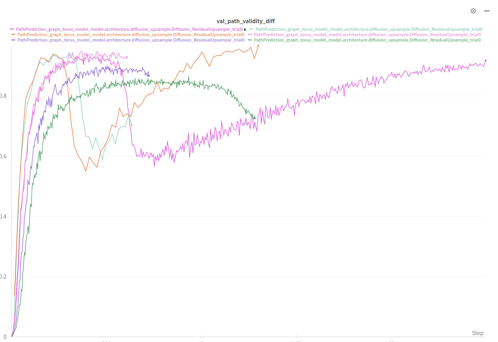
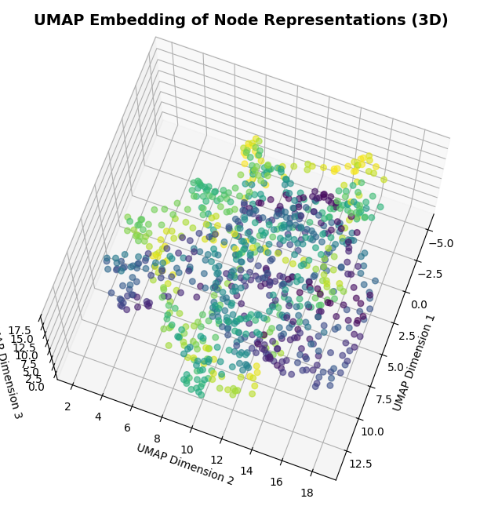

During training the model goes to a weird phase where the accuracy goes down and then up again. It happens for all training proportions.

When trained on the maze graph, the embeddings organize themselves into entangled paths

The model does is harder to train on random graphs. On Watz-Strogatz with 800 nodes it reaches around 70% path validity when trained on 0.9 of training data. The dimension need to be much higher then on the other problems. The embeddings have no structure.